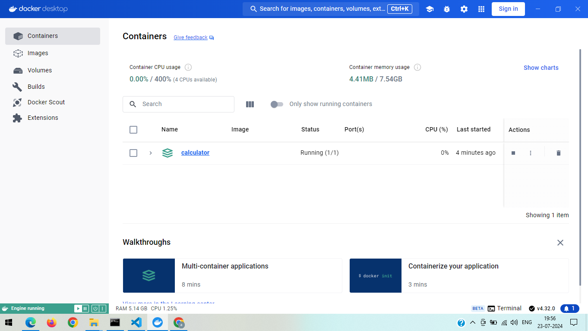

# Simple Calculator React App

## Project Description

This is a simple calculator application built with React. The calculator allows users to perform basic arithmetic operations such as addition, subtraction, multiplication, and division.

## Functionality

- **Basic Operations**: The calculator can perform addition, subtraction, multiplication, and division.
- **Clear Input**: Users can clear the input using the "C" button.
- **Evaluate Expression**: Users can evaluate the expression using the "=" button.

## Dockerization

The app is containerized using Docker. We use a multi-stage build to first build the React application and then serve it using nginx.

### Dockerfile

```dockerfile
# Dockerfile
# Stage 1: Build the React app
FROM node:16 AS build

# Set the working directory inside the container
WORKDIR /app

# Copy the package.json and package-lock.json files to the working directory
COPY package.json ./
COPY package-lock.json ./

# Install the dependencies
RUN npm install

# Copy the rest of the application files to the working directory
COPY . ./

# Build the React application
RUN npm run build

# Stage 2: Serve the React app using nginx
FROM nginx:alpine

# Copy the build output from the previous stage to the nginx html directory
COPY --from=build /app/build /usr/share/nginx/html

# Expose port 80 to the outside world
EXPOSE 80

# Start nginx
CMD ["nginx", "-g", "daemon off;"]

Explanation:

Stage 1: Build the React app:

Uses the node:16 image to build the React application.
Sets the working directory to /app.
Copies package.json and package-lock.json to the container and installs the dependencies.
Copies the rest of the application files and builds the React application.
Stage 2: Serve the React app using nginx:

Uses the nginx:alpine image to serve the built React application.
Copies the build output from the previous stage to the nginx html directory.
Exposes port 80 and starts nginx.

